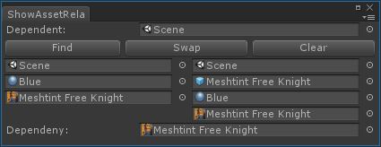

# Show Asset Relationship

Show relationship between two assets in Unity.

## Usage

1. Open `Tools/Show Asset Relationship`
2. Drag and drop asset to `Dependent` field and `Dependency` field
3. Click `Find` to show results
4. Click `Swap` button to swap `Dependent` and `Dependency`.
5. Click `Clear` button to clear `Dependent`, `Dependency` and results.

## Install

1. Clone repository into `Assets/Editor` directory.

## Environment

- Windows 10
- macOS 10.13.6
- Unity 2017.4.2f2 and 2018.2.0f2
